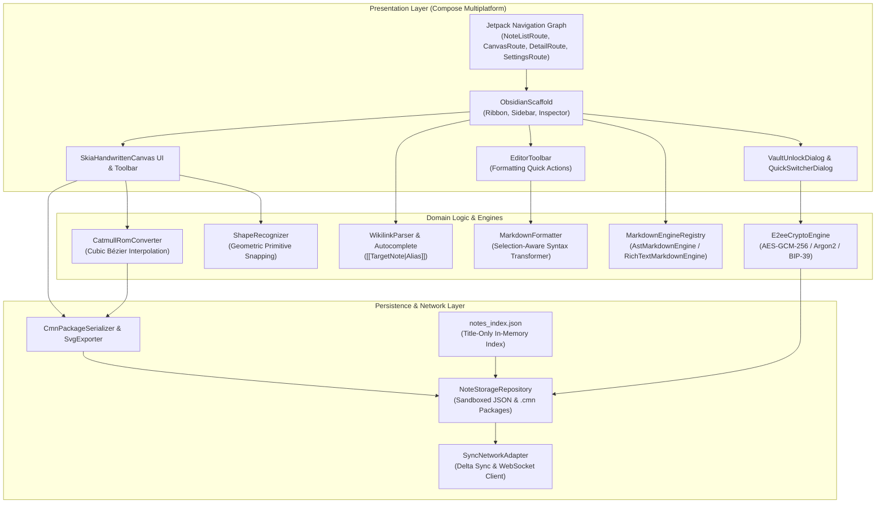
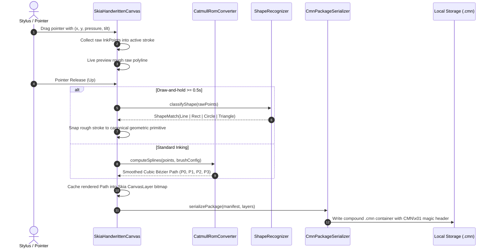
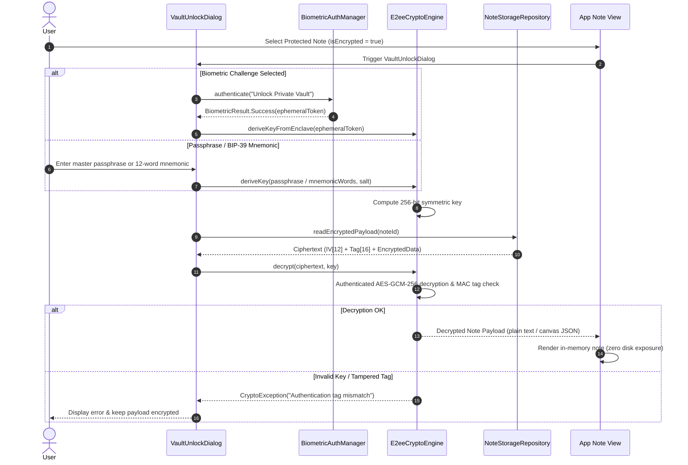
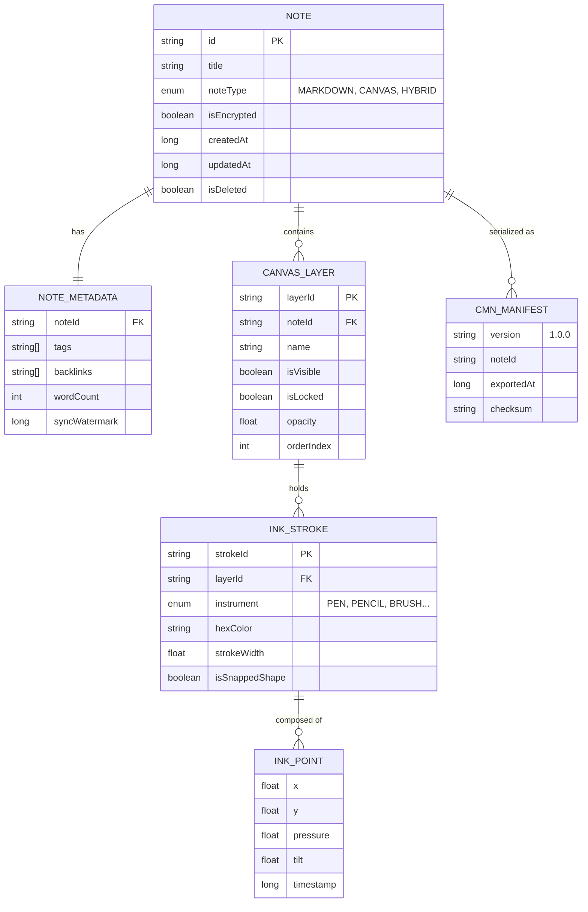
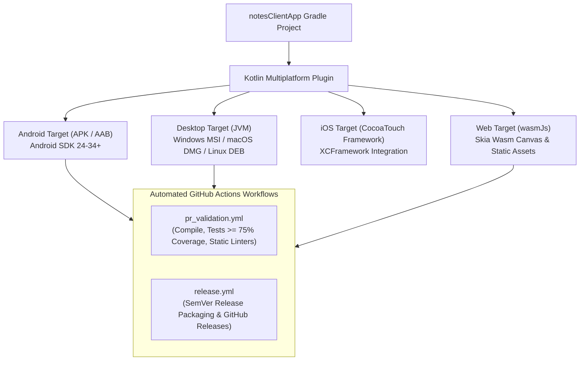

# System Architecture: Notes Alltogether Client (`notesClientApp`)

## 1. Architectural Overview

`notesClientApp` is a cross-platform, local-first personal knowledge management (PKM) and handwritten note-taking client built with **Kotlin Multiplatform (KMP)** and **Compose Multiplatform**. It delivers high-performance vector inking, rich markdown editing with bi-directional wikilinks, client-side zero-knowledge End-to-End Encryption (E2EE), and seamless synchronization with the `notesServer` backend.

### 1.1. Target Platforms & Runtime Environments
- **Desktop (JVM)**: Windows (MSI/EXE), macOS (DMG/PKG), Linux (DEB/AppImage) via Compose Desktop.
- **Android**: Android 7.0+ (API level 24 through 34+).
- **iOS**: Native CocoaTouch UI integration via Kotlin Multiplatform iOS targets.
- **Web (Wasm)**: Kotlin/Wasm (`wasmJs`) running high-performance Skia Canvas via WebAssembly.

### 1.2. Repository & Module Topography
```text
notesClientApp/
├── common-models/           # Shared KMP domain models, DTOs & serialization contracts
│   └── src/commonMain/kotlin/com/notes/common/models/
├── composeApp/              # Compose Multiplatform UI, state machines & client engines
│   ├── src/commonMain/kotlin/com/notes/client/
│   │   ├── biometrics/      # Biometric authentication adapters & enclave integration
│   │   ├── canvas/          # Skia vector canvas, smoothing, brushes, shapes & .cmn codecs
│   │   ├── components/      # Material 3 shared UI components & dialogs
│   │   ├── crypto/          # E2EE engine, AES-GCM-256, BIP-39 mnemonic phrase derivations
│   │   ├── editor/          # Pluggable Markdown engines & wikilink parsers
│   │   ├── models/          # Client-specific presentation state models
│   │   ├── navigation/      # Type-safe Jetpack Navigation destinations
│   │   ├── storage/         # Sandboxed file persistence & title-only index catalog
│   │   └── theme/           # Material 3 color palettes, typography & spacing tokens
│   ├── src/androidMain/     # Android platform drivers & hardware keystore bindings
│   ├── src/jvmMain/         # Desktop JVM entrypoint & desktop file system sandbox
│   ├── src/iosMain/         # iOS UIKit platform hooks & Secure Enclave bridge
│   └── src/wasmJsMain/      # Wasm/Browser entrypoint & canvas bindings
└── docs/                    # Architectural blueprints, changelogs, dependencies & features
```

### 1.3. Architecture Pattern: Clean MVI (Model-View-Intent)
The client follows strict unidirectional data flow (UDF) with Clean Architecture separation:
- **Presentation Layer**: Declarative Compose UI screens emitting user intents, consuming immutable UI states.
- **Domain Layer**: Dedicated business logic engines (`ShapeRecognizer`, `CatmullRomConverter`, `WikilinkParser`, `E2eeCryptoEngine`).
- **Data / Storage Layer**: Sandboxed local disk persistence (`JsonIndexNoteRepository`), title-only indexing, and HTTP/WebSocket network adapters.

---

## 2. Flow Diagrams

### 2.1. Overall Client Architecture & Boundary Diagram


### 2.2. Handwritten Inking & Vector Smoothing Pipeline


### 2.3. End-to-End Encryption (E2EE) Vault Decryption Flow


---

## 3. API Contracts (Client-to-Server Integration)

The client interacts with `notesServer` through a resilient HTTP and WebSocket gateway. All authenticated requests transmit the Bearer token in the `Authorization` header.

### 3.1. Authentication Endpoints

#### `POST /api/v1/auth/login`
- **Headers**: `Content-Type: application/json`
- **Request Body**:
  ```json
  {
    "username": "alice",
    "password": "SecurePassword123!"
  }
  ```
- **Success Response (200 OK)**:
  ```json
  {
    "accessToken": "eyJhbGciOiJIUzI1NiIsInR5cCI6IkpXVCJ9...",
    "refreshToken": "dGhpcy1pcy1hLXJlZnJlc2gtdG9rZW4...",
    "userId": "usr_94a8f1b2",
    "expiresIn": 3600
  }
  ```
- **Error Response (401 Unauthorized)**:
  ```json
  {
    "error": "INVALID_CREDENTIALS",
    "message": "Invalid username or password"
  }
  ```

#### `POST /api/v1/auth/refresh`
- **Headers**: `Content-Type: application/json`
- **Request Body**:
  ```json
  {
    "refreshToken": "dGhpcy1pcy1hLXJlZnJlc2gtdG9rZW4..."
  }
  ```
- **Success Response (200 OK)**:
  ```json
  {
    "accessToken": "eyJhbGciOiJIUzI1NiIsInR5cCI6IkpXVCJ9...",
    "expiresIn": 3600
  }
  ```

### 3.2. Delta Synchronization Endpoint

#### `POST /api/v1/sync`
- **Headers**: `Authorization: Bearer <accessToken>`, `Content-Type: application/json`
- **Request Body**:
  ```json
  {
    "lastSyncTimestamp": 1727438400000,
    "clientChanges": [
      {
        "id": "note_01HXYZ",
        "title": "Quantum Computing Notes",
        "updatedAt": 1727439100000,
        "isDeleted": false,
        "isEncrypted": false,
        "payload": "# Quantum Algorithms\n\nGrover and Shor..."
      }
    ]
  }
  ```
- **Success Response (200 OK)**:
  ```json
  {
    "syncWatermark": 1727439120000,
    "serverChanges": [
      {
        "id": "note_02ABC",
        "title": "Project Roadmap",
        "updatedAt": 1727439050000,
        "isDeleted": false,
        "isEncrypted": false,
        "payload": "- [x] Milestone 1\n- [ ] Milestone 2"
      }
    ],
    "conflictsResolved": []
  }
  ```
- **Error Response (409 Conflict)**:
  ```json
  {
    "error": "SYNC_CONFLICT",
    "message": "Timestamp divergence exceeds threshold",
    "serverVersion": 1727439150000
  }
  ```

### 3.3. Real-Time Collaboration WebSocket Gateway

#### `WS /api/v1/ws/notes/{noteId}`
- **Headers / Query**: `Authorization: Bearer <accessToken>`
- **Frame Protocol**: JSON Text frames with `type` discriminator.
- **Client Join Frame**:
  ```json
  {
    "type": "JOIN",
    "userId": "usr_94a8f1b2",
    "clientColor": "#4F46E5"
  }
  ```
- **Server Presence Broadcast**:
  ```json
  {
    "type": "PRESENCE",
    "activeUsers": [
      {"userId": "usr_94a8f1b2", "color": "#4F46E5"},
      {"userId": "usr_38b2c4e1", "color": "#06B6D4"}
    ]
  }
  ```
- **Canvas Lock Request & Grant**:
  ```json
  {"type": "CANVAS_LOCK_REQUEST", "layerId": "layer_main"}
  ```
  ```json
  {"type": "CANVAS_LOCK_GRANTED", "layerId": "layer_main", "lockedBy": "usr_94a8f1b2"}
  ```

---

## 4. Module & Function Definitions

### 4.1. Vector Inking Engine (`com.notes.client.canvas`)
- **`CatmullRomConverter`**:
  - `computeSplines(points: List<InkPoint>, brush: BrushConfig): List<BezierSegment>`
  - Transforms raw stylus input points into continuous $C^1$ cubic Bézier curves. Synthesizes boundary ghost points ($P_{-1}, P_{N+1}$) to eliminate endpoint flattening.
  - *Error Fallback*: If points $< 3$, renders a straight line segment between available coordinates.
- **`BrushConfig`**:
  - Encapsulates physical inking characteristics: `minWidth`, `maxWidth`, `pressureSensitivity`, `velocityDamping`, and `instrument` (`PEN`, `FOUNTAIN_PEN`, `PENCIL`, `CALLIGRAPHY_BRUSH`, `HIGHLIGHTER`, `VECTOR_ERASER`).
- **`ShapeRecognizer`**:
  - `classifyShape(points: List<InkPoint>): ShapeClassification`
  - Mathematical classifier computing aspect ratio, vertex angles, bounding-box aspect, and radial variance from centroid. Classifies `STRAIGHT_LINE`, `RECTANGLE`, `CIRCLE`, `ELLIPSE`, and `TRIANGLE`.
- **`CmnPackageSerializer`**:
  - `serialize(manifest: CmnManifest, layers: List<CanvasLayer>): ByteArray`
  - Compiles canvas data into the compound `.cmn` container format enforcing the 4-byte magic signature `CMN\x01` (`0x43 0x4D 0x4E 0x01`).
- **`SvgExporter`**:
  - `exportToSvg(layers: List<CanvasLayer>, width: Float, height: Float): String`
  - Generates standalone, standard W3C SVG XML documents mapping Bézier curves to `<path d="M... C..."/>` elements for loss-less vector printing.

### 4.2. Markdown & PKM Engine (`com.notes.client.editor`)
- **`MarkdownEngineRegistry`**:
  - Pluggable strategy provider allowing runtime selection between `AstMarkdownEngine` (rapid CommonMark AST traversal) and `RichTextMarkdownEngine` (interactive WYSIWYG rendering with callout alerts and interactive checkboxes).
- **`WikilinkParser`**:
  - `extractWikilinks(content: String): List<WikilinkMatch>`
  - Extracts bi-directional links (`[[TargetNote]]` and aliased `[[TargetNote|Display Text]]`), calculating forward links and discovering incoming backlinks across workspace notes.

### 4.3. Persistence & Local Indexing (`com.notes.client.storage`)
- **`NoteStorageRepository`**:
  - Zero-SQL, file-based persistence storing individual notes in sandboxed directories.
- **`JsonIndexNoteRepository`**:
  - In-memory high-speed cache backed by `notes_index.json`. Stores only metadata (id, title, tags, updatedAt, isEncrypted) to allow sub-millisecond search queries while keeping body contents decoupled and encrypted at rest.

### 4.4. Security & Cryptography (`com.notes.client.crypto` & `com.notes.common.crypto`)
- **`E2eeCryptoEngine`**:
  - `encrypt(payload: ByteArray, key: ByteArray): ByteArray`
  - `decrypt(ciphertext: ByteArray, key: ByteArray): ByteArray`
  - Enforces authenticated symmetric encryption using AES-GCM-256 with random 12-byte initialization vectors (IV) and 16-byte authentication tags.
- **`Bip39RecoveryKit`**:
  - Generates 12-word mnemonic phrases and derives deterministic 256-bit root master keys using PBKDF2 with HMAC-SHA512.
- **`ProtectedNoteCodec`**:
  - `pack(note: SelfContainedProtectedNote): String`
  - `unpack(rawContent: String): SelfContainedProtectedNote`
  - Encodes and decodes self-contained protected notes (`.nap`) with `NA_PROTECTED_V1` magic header, client application signature, metadata JSON, and unencrypted raw payload boundary.
  - Verifies passwords using PBKDF2 HMAC-SHA256 (1,000 iterations) with constant-time equality checks.
- **`HmacSignatureEngine` & `PureCrypto`**:
  - Pure Kotlin zero-dependency SHA-256 and HMAC-SHA256 implementations for cross-platform KMP targets.
  - Generates and verifies canonical request signatures: `METHOD\nPATH\nTIMESTAMP\nNONCE\nBODY_HASH`.

### 4.5. Client Authentication & Gated Settings (`com.notes.client.auth`)
- **`AuthManager`**:
  - Manages reactive authentication state (`SessionState.Authenticated` / `Unauthenticated`).
  - Stores user profile, access token, `userApiKey`, `signingSecret`, and `UserCloudConfig`.
- **`LoginRequiredDialog`**:
  - Modal authentication barrier intercepting attempts to open system settings or cloud storage configurations for unauthenticated users.

### 4.6. Device-Local Hardware Settings Driver (`com.notes.client.storage`)
- **`DeviceSettingsDriver`**:
  - Manages physical device runtime settings (`DeviceLocalModuleConfig`), including Skia GPU hardware acceleration, stylus pressure sensitivity curve, and local disk cache directories.
  - Persisted strictly to physical device filesystem (`device_modules/module_{id}.json`), completely decoupled from cloud synchronization.

---

## 5. Security & Authorization Architecture

### 5.1. Zero-Knowledge Client-Side Encryption
- Notes flagged as `isEncrypted = true` ("Encrypted Notes") are encrypted **exclusively on the client device** using AES-GCM-256.
- Plaintext data never touches the network and is never written to disk in unencrypted form.

### 5.2. Cryptographic Algorithm Standards
- **Symmetric Cipher**: AES-256 in Galois/Counter Mode (GCM).
- **Authentication**: 128-bit MAC tag verified prior to any plaintext memory release.
- **Key Derivation (Passphrase)**: PBKDF2 / Argon2id with random 16-byte salt and minimum 100,000 iterations.
- **Recovery Mnemonic**: BIP-39 English wordlist standard with checksum validation.
- **Biometric Enclave**: Hardware Keystore (Android KeyStore / Apple Secure Enclave) wraps the derived master vault key; biometric challenge releases the key into ephemeral memory.

### 5.3. Self-Contained Protected Notes (`.nap`)
- Notes flagged as `isProtected = true` are stored in a self-contained container format (`.nap`).
- **Unencrypted Payload**: The note content (Markdown or `.cmn`) is preserved in its native unencrypted format inside the container boundary, meeting compliance and direct-sync requirements.
- **Embedded Protection Data**: All protection metadata (salt, PBKDF2 check tag, auto-lock timeout, password hint) is embedded directly within the container header.
- **Original Client Enforcement**: Only authentic clients possessing the verified application signature can unpack and display the note.
- **Collaboration & Sync Boundary**: Protected notes cannot be co-edited in real time (`PROTECTED_NOTE_COLLAB_DISABLED`). Synchronization executes as an atomic whole-file replacement via `PUT /api/v1/sync/protected/{noteId}` without diffing.

### 5.4. Two-Tier Configuration Architecture
- **Tier 1 (User Cloud Profile - `UserCloudConfig`)**: Cloud-synchronized settings per user account, including local/remote vault paths, storage backend type (Cloudflare R2, MinIO, Local Disk), auto-sync schedules, and licensed modular constructor extensions.
- **Tier 2 (Device Local Runtime - `DeviceLocalModuleConfig`)**: Hardware-specific configurations (GPU rendering, stylus pressure curve, local disk cache path) stored exclusively on the physical device and never uploaded to cloud.

### 5.5. Per-User API Security & Cloudflare R2 Multi-Tenancy
- **API Request Authentication**: Client-server API requests carry `X-User-Key`, `X-Timestamp`, `X-Nonce`, and `X-Signature`, validated against the user's private `signingSecret`.
- **R2 Tenant Isolation**: All remote objects in Cloudflare R2 are namespaced under `users/{userId}/*`. The server validates that pre-signed URL requests cannot reference keys outside the caller's tenant boundary, returning HTTP 403 on cross-tenant attempts.

---

## 6. Feature Toggles & Pluggable Engine Architecture

To allow flexible customization without rebuilding, the client implements pluggable strategies:

| Engine / Toggle | Strategy Options | Default | Governing Config / Registry |
| :--- | :--- | :--- | :--- |
| **Markdown Engine** | `AstMarkdownEngine`, `RichTextMarkdownEngine` | `RichTextMarkdownEngine` | `MarkdownEngineRegistry` |
| **Drawing Instruments** | `PEN`, `FOUNTAIN_PEN`, `PENCIL`, `CALLIGRAPHY_BRUSH`, `HIGHLIGHTER`, `VECTOR_ERASER` | `PEN` | `BrushConfig.kt` |
| **Shape Auto-Snapping**| Enabled (0.5s hold) / Disabled | Enabled | `CanvasToolbar` / Settings |
| **Workspace Layout** | Zero-tab Obsidian-style (Ribbon + Sidebar + Inspector) | Enforced (ADR Q6) | `ObsidianScaffold` |
| **Storage Engine** | Zero-SQL Sandboxed JSON / .cmn | Enforced (ADR Q19) | `NoteStorageRepository` |

---

## 7. Data Models & Schemas

### 7.1. Entity-Relationship Diagram (`:common-models`)


### 7.2. Compound `.cmn` Package Structure
```text
Offset (Bytes)   Length          Field Content
0x00             4 Bytes         Magic Header: 0x43 0x4D 0x4E 0x01 ('CMN\x01')
0x04             4 Bytes         Manifest Length (Little-Endian UInt32)
0x08             N Bytes         Manifest JSON (UTF-8 Encoded Schema)
0x08 + N         4 Bytes         Layer Payload Count (UInt32)
...              M Bytes         Binary Layer & Stroke Coordinate Arrays
```

---

## 8. Synchronization & Offline Strategy

1. **Local-First Primacy**: Every user modification is persisted to the local file sandbox before any network transmission is initiated.
2. **Title-Only In-Memory Index**: Fast search, filtering, and tag exploration are powered by `notes_index.json`, decoupling metadata lookup from note body reading.
3. **Timestamp Watermarks**: The client records `lastSyncTimestamp`. During delta sync, only notes modified after this timestamp are transmitted.
4. **Last-Write-Wins (LWW) Resolution**: Client and server rely on monotonically increasing UTC timestamps. In conflict scenarios, server revisions are tracked in `note_revisions` to allow version history rollback.
5. **Offline Queueing**: Network failures gracefully queue modifications into an in-memory sync buffer with automatic exponential backoff retry.

---

## 9. Deployment Architecture



- **Build Tooling**: Gradle 8.x with Kotlin Multiplatform and Compose Multiplatform Gradle plugins.
- **Code Coverage Gate**: Automated unit and integration tests strictly enforce $\ge 75\%$ code coverage on every Pull Request.
- **Static Analysis**: `ktlint` and `detekt` enforce clean code formatting and architectural boundaries.
